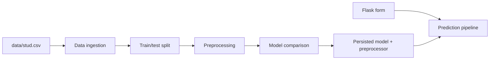

# Student Performance Prediction

An end-to-end machine-learning project that predicts a student's mathematics score from demographic and
academic inputs. It separates data ingestion, transformation, model selection, persistence, and web inference
into a small reusable pipeline.

<p>
  
  
  
  
  
</p>

## How it works



## Repository guide

- `src/components/` — ingestion, transformation, model training, and prediction components.
- `src/components/pipeline/` — training and prediction entry points.
- `data/` — source dataset and exploratory notebooks.
- `artifacts/` — persisted model, preprocessor, and prepared datasets used by the app.
- `templates/` and `app.py` — browser form and Flask prediction route.

## Run locally

```powershell
python -m venv .venv
.\.venv\Scripts\Activate.ps1
pip install -r requirements.txt
python app.py
```

Open `http://localhost:5000`, choose **Predict**, and submit the required student attributes. The application
passes the form through the persisted preprocessing and prediction pipeline before rendering the score.

## Training

Run `python src/components/data_ingestion.py` to execute the current training entry point. Training output and
CatBoost logs are local artifacts and are not versioned; the small persisted artifacts required by the demo
remain in the repository.
